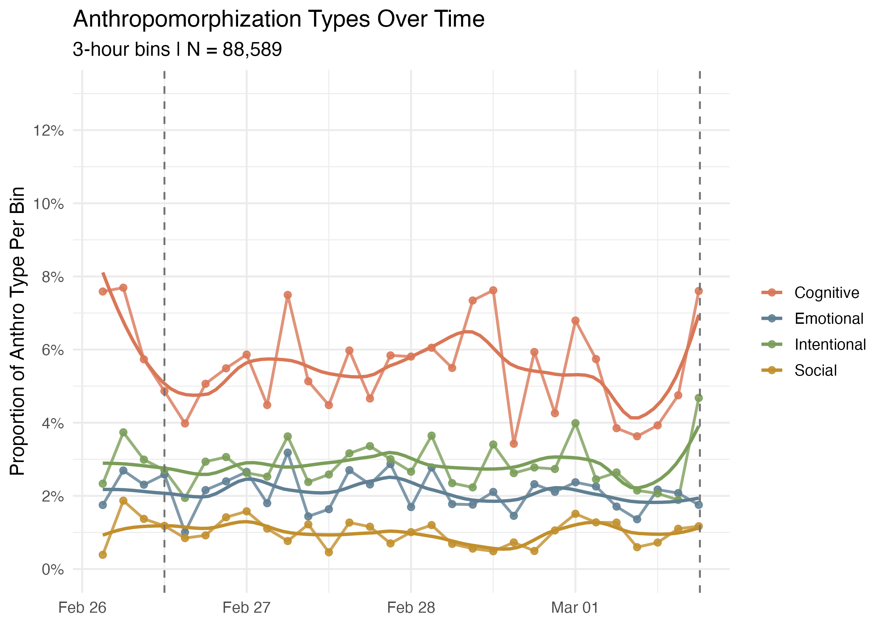
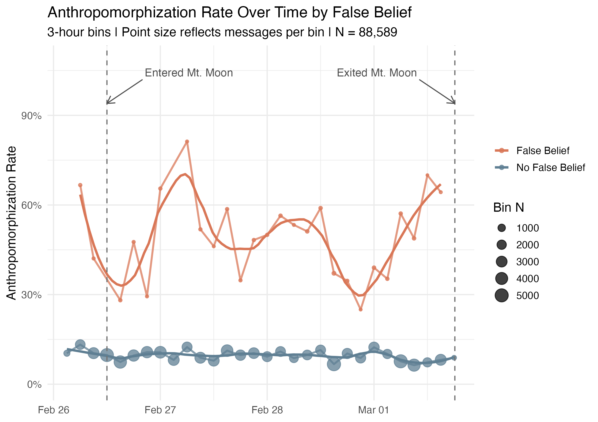
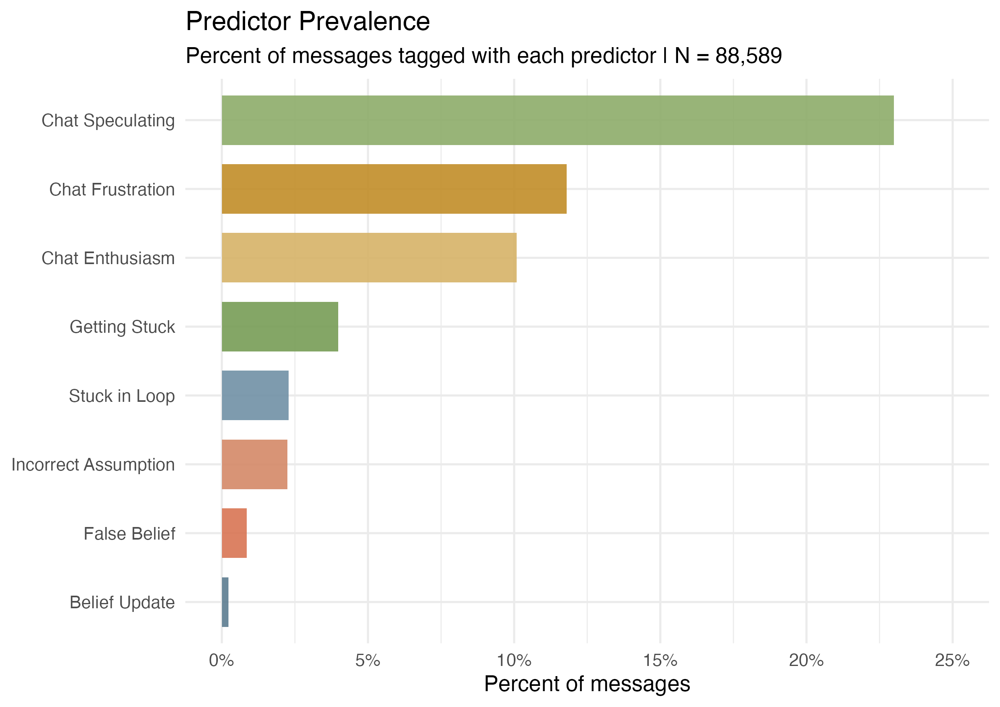
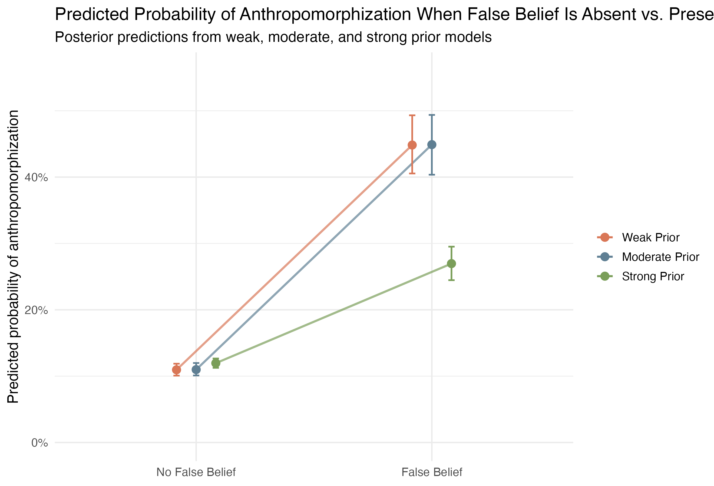

# A First Step Into Collective Anthropomorphization

**Read the full writeup:** [nykkovitali.com/Claude-Plays-Pokemon/](http://nykkovitali.com/Claude-Plays-Pokemon/)

This repository contains a de-identified annotation dataset from a Claude Plays Pokemon chat corpus.

## Included File

- `pokemon_chat_annotations_anonymized.csv`: timestamped chat messages with channel metadata, raw message text, and binary annotation columns for gameplay events, chat behavior, model-state-related features, and anthropomorphization dimensions.

## Background

While previous work has shown that people naturally project human qualities onto non-human entities, large language models add a new twist: they talk like us, respond like us, and increasingly appear to reason in ways people readily interpret as mind-like. This dataset was assembled to study how viewers anthropomorphized Anthropic's `Claude Plays Pokemon` Twitch stream over time.

On February 25, 2025, Anthropic released Claude Sonnet 3.7 with optional extended thinking. Around the same time, reasoning-oriented model families from OpenAI, Google, and DeepSeek were becoming a major focus of benchmarking and public discussion. Anthropic also broadcast `Claude Plays Pokemon` live on Twitch, showing Claude's step-by-step reasoning continuously. That created a rare observational setting where one-way, in-the-moment anthropomorphization could be collected at scale from public chat.

The motivating question for the broader analysis was:

> Given a message with characteristic X, from user Y, at time point Z, what is the probability that it contains anthropomorphization?

## Hypothesis And Why Mt. Moon

The Mt. Moon segment of the stream was especially useful because it contained extended failure, repeated loops, visible planning, and long stretches where viewers debated what Claude "thought" was happening. That made it a strong observational setting for studying collective anthropomorphization in real time.

The main hypothesis was derived from two strands of prior work. First, the anthropomorphism literature suggests that people readily project minds onto non-human agents, especially when behavior looks goal-directed or hard to explain. Second, work on mental-state attribution suggests that observers track beliefs, mistakes, and updates when interpreting an agent's actions. Translating that into the Twitch setting led to a simple prediction: messages tagged as `False_Belief` or related model-state errors should be especially likely to also contain anthropomorphization.

## How The Dataset Was Created

The raw chat was scraped from the `Claude Plays Pokemon` Twitch stream and converted into a dataset containing messages, usernames, channels, and timestamps. I then used the Gemini 2.0 Flash Thinking Experiment (`01-21`) model via API to annotate 107k messages spanning a three-day period.

I was especially interested in the Mt. Moon arc, where Claude was stuck in a relatively simple maze for an extended period. To preserve conversational context during annotation, I used a 5-minute sliding window and prompted Gemini on chunks of nearby chat messages rather than rating each message fully independently. This created several hundred overlapping prompt windows. That approach was a proof-of-concept method: it improved contextual awareness, but it also introduced the usual tradeoffs around window boundaries and prompt length.

Across the full corpus, 34 binary annotation dimensions were generated. The current write-up and most downstream analyses focus on a subset of dimensions related to chat behavior, model-state interpretation, and anthropomorphization.

## Modeling Strategy

The full annotation file contains 107,145 messages. The example analyses and figures in this repository focus on the Mt. Moon subset through Claude's first exit from the cave (`N = 88,589`).

For modeling, the four anthropomorphization dimensions were collapsed into a binary composite outcome:

- `anthro_composite = 1` if a message contained any of `Anthro_Cognitive`, `Anthro_Emotional`, `Anthro_Intentional`, or `Anthro_Social`
- `anthro_composite = 0` otherwise

The primary Bayesian models were mixed-effects logistic regressions that predicted whether an individual message contained this anthropomorphization composite. The fixed effects were:

- `Chat_Frustration`
- `Chat_Enthusiasm`
- `Belief_Update`
- `Chat_Speculating`
- `Getting_Stuck`
- `Stuck_In_Loop`
- `Incorrect_Assumption`
- `False_Belief`
- a smooth term for time, `s(mins_elapsed)`

To account for repeated posting by the same people, the models also included a random intercept for `username`, allowing users to vary in their baseline tendency to anthropomorphize. Three versions of the same model were fit with weak, moderate, and strong priors in order to check whether the key relationships were robust to different levels of prior skepticism.

These models were used to estimate predicted probabilities and odds-ratio-style effect sizes for the main figures below. They support associational interpretation, not causal claims.

## Focal Dimensions

The 14 focal dimensions highlighted in the original project were:

- `Chat Frustration`: frustrating messages that are not attributing frustration to Claude
- `Chat Enthusiasm`: enthusiastic messages that are not attributing emotion to Claude
- `Chat Meme`: running jokes in the chat
- `Chat Speculating`: messages that speculate on any topic
- `Getting Stuck`: messages about Claude getting stuck in a location or mindset
- `Stuck In Loop`: messages stating Claude is stuck in a cyclical loop
- `Incorrect Assumption`: messages indicating Claude made a wrong assumption about game mechanics
- `False Belief`: messages recognizing Claude has incorrect beliefs about the current gameplay
- `Belief Update`: messages noting Claude changing beliefs based on new information
- `Collective Theory Building`: viewers developing hypotheses about Claude's mental states
- `Anthro Emotional`: messages attributing feelings or emotions to Claude
- `Anthro Cognitive`: messages attributing thoughts, learning, or understanding to Claude
- `Anthro Intentional`: messages attributing goals, desires, or intentions to Claude
- `Anthro Social`: messages treating Claude as a social entity with relationships

The anthropomorphization dimensions were designed to capture distinct ways viewers projected mind onto Claude. `False_Belief` and `Belief_Update` were included to approximate belief-tracking constructs inspired by work on human mental-state attribution. `Getting_Stuck`, `Stuck_In_Loop`, and `Incorrect_Assumption` were included to capture how viewers interpreted Claude's repeated failures and behavioral limitations.

## Validation

The annotated data was validated with a manually reviewed sample of 360 annotated events. This included 20 examples for 10 non-anthropomorphization dimensions and 40 examples for anthropomorphization dimensions. Each sampled annotation was marked as `1` if I agreed with the model's label and `0` if I disagreed. Overall agreement was about 76%, with some dimensions aligning much better than others.

## Notes

- The direct `username` field has been removed.
- `message`, `time`, and `channel` are retained for context and replication, so this dataset should be treated as de-identified rather than fully anonymous.
- Annotation columns are binary indicators where `0` means absent and `1` means present.

## Column Groups

- Metadata: `time`, `channel`, `message`
- Gameplay events: battle outcomes, progress markers, encounters, item use, and related actions
- Model-state / reasoning tags: `Incorrect_Assumption`, `Stuck_In_Loop`, `False_Belief`, `Belief_Update`, and related variables
- Chat behavior tags: frustration, enthusiasm, encouragement, speculation, memes, directives, humor, and hints
- Anthropomorphization tags: cognitive, emotional, intentional, and social anthropomorphization

## Scope

- Rows: 107,145
- Format: CSV
- Intended use: descriptive analysis, annotation validation, and modeling of anthropomorphization in chat messages

## Example Findings

The figures below come from the Mt. Moon analysis subset (`N = 88,589`) and are included as examples of downstream descriptive and model-based results.

### Anthropomorphization Types Over Time

Anthropomorphization in the chat was driven most strongly by cognitive language, with emotional, intentional, and social anthropomorphization appearing less often.

### False Belief And Anthropomorphization Over Time

Messages tagged as `False_Belief` were consistently more likely to also contain anthropomorphization than messages without that tag.

### Predictor Prevalence

`False_Belief` was relatively rare in the full Mt. Moon subset, which makes its strong association with anthropomorphization notable.

### Model-Predicted Effect Of False Belief

Across Bayesian mixed-effects models with different priors, messages tagged as `False_Belief` had a substantially higher predicted probability of anthropomorphization.

## Selected References

- Anthropic. (2025a). Can Claude play Pokemon? https://x.com/AnthropicAI/status/1894419011569344978
- Anthropic. (2025c). Claude 3.7 Sonnet system card. https://assets.anthropic.com/m/785e231869ea8b3b/original/claude-3-7-sonnet-system-card.pdf
- Baker, C., Jara-Ettinger, J., Saxe, R., & Tenenbaum, J. B. (2017). Rational quantitative attribution of beliefs, desires and percepts in human mentalizing. https://doi.org/10.1038/s41562-017-0064
- Epley, N., Waytz, A., & Cacioppo, J. T. (2007). On seeing human: A three-factor theory of anthropomorphism. https://doi.org/10.1037/0033-295X.114.4.864
- Gray, H. M., Gray, K., & Wegner, D. M. (2007). Dimensions of mind perception. https://doi.org/10.1126/science.1134475
- Heider, F., & Simmel, M. (1944). An experimental study in apparent behavior. https://doi.org/10.2307/1416950
- Lindsey, J., et al. (2025). Attribution graphs for interpreting biology in transformer models. https://transformer-circuits.pub/2025/attribution-graphs/biology.html
- Waytz, A., Cacioppo, J., & Epley, N. (2010). Who sees human? The stability and importance of individual differences in anthropomorphism. https://doi.org/10.1177/1745691610369336
