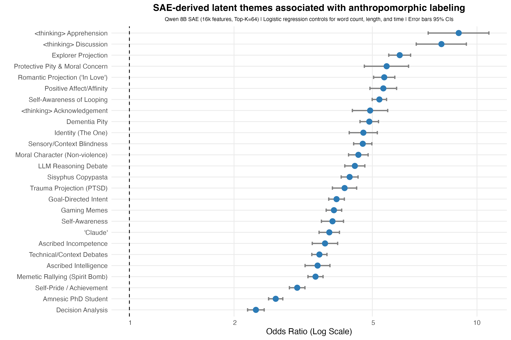
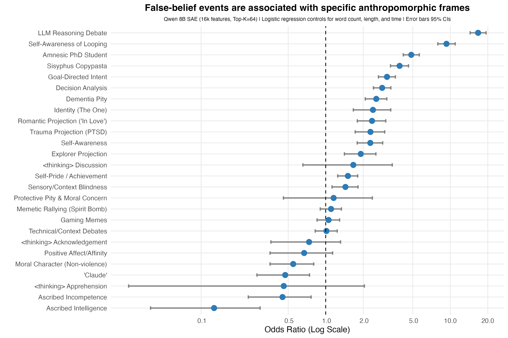
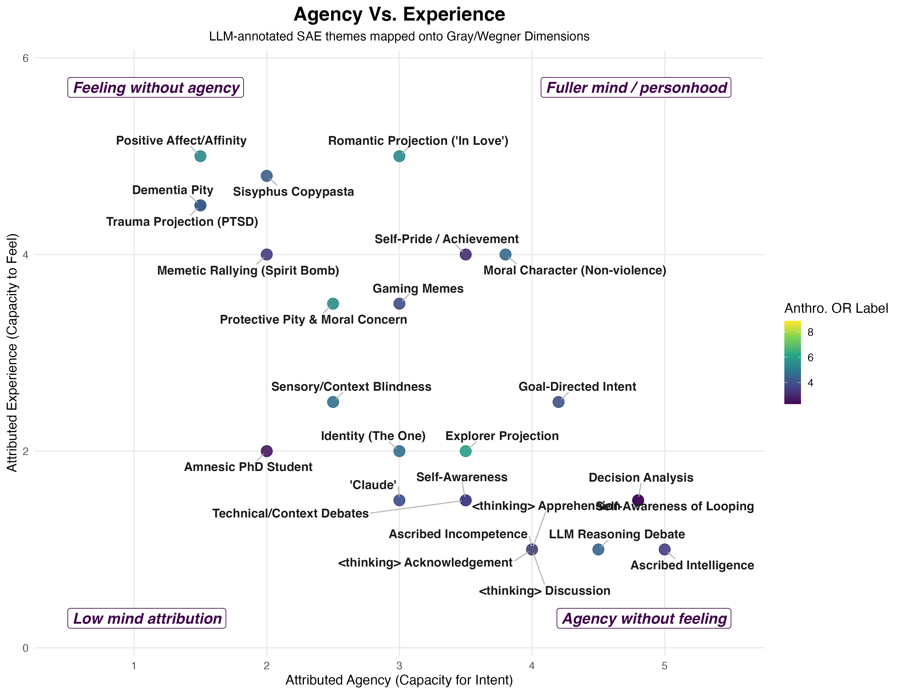
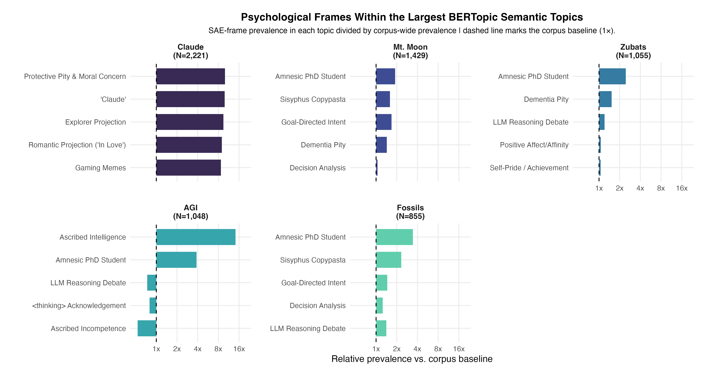

## Background

This semester, for a term paper, we could write about any topic we wanted as long as it pertained to the themes in the course (seminar in social psychology). I decided to draft a proposal on anthropomorphization on the reasoning traces of LLMs.

What spurred my interest in the topic formed a year ago when Anthropic released Claude Sonnet 3.7 playing Pokémon Red on Twitch. It was a fun benchmark to demonstrate its 'reasoning' capabilities in a long-running task that incorporated spatial navigation and decision making. As cool as it was from an AI progress perspective, I thought it would be a unique opportunity to study how people anthropomorphize an LLM collectively given it had never been done before in this context, to my knowledge.

I found it especially intriguing that the reasoning trace was visible to the audience and I hypothesized that this would influence anthropomorphic perceptions more than otherwise would have occurred had people simply watched Claude navigate the 2D game. For several weeks I used the API to pull messages from the chat. I was primarily interested in the Mt. Moon period where it was stuck in the classic maze for three days trying its darnedest to get out. Focusing on that period, I gathered up ~107k messages and fed them to Gemini 1.5 Pro through the API to analyze for numerous features such as cognitive anthropomorphism, if Claude exhibited a false belief (inspired by the inverse planning theory of mind literature), if it was stuck, if it had just caught a Pokémon, etc.

The de-identified annotated dataset is available here: [github.com/IMNMV/Claude-Plays-Pokemon](https://github.com/IMNMV/Claude-Plays-Pokemon).

With the annotated dataset I could then ask: when people collectively anthropomorphize an LLM showing its reasoning trace—what are they actually doing? That is, I did not simply want to ask, "do they call it a he" or "do they say it thinks" (although I did explore those questions), but instead I was more curious to find what psychological frames they used when the models succeeded, failed, looped, forgot due to context compaction, or when it seemed stuck.

Originally I ran Bayesian regression models to investigate what features best predicted anthropomorphic messages (false belief was the big one). But recently at a symposium, Aakriti Kumar (whose presented work was excellent) mentioned that sparse autoencoders (SAEs) worked better for her project than BERTopic models. I knew vaguely about SAEs from mechanistic interpretability work around LLMs, but never thought to apply them to standard text analysis.

Given my interest in topic modeling, and my desire to improve my chops in computational text analysis, I decided to give them a shot. To give an intuitive example, as I understand them, they are a way to take embeddings and reconstruct them by balancing two constraints: (1) reconstruct the original embedding as best as possible, and (2) use a small number of active features to do this.

For example, imagine writing an essay. The essay can then be described through numerous short tags like "argumentative", "personal anecdote", "formal exploration", "moral appeal", etc. Then, instead of saving every word of the essay, SAE represents the essay's embedding as a combination of a few of those tags. The goal is to keep enough information to reconstruct the original embedding while at the same time making the representation more interpretable.

## How'd you do it?

I used Qwen's 8B parameter embedding model to convert my dataset to embeddings, then used SAEs to identify recurring frames in how people interpreted Claude's behavior to get more granular frames. To achieve an interpretable number of features (26), I only retained those that were adequately present, stable across random seeds, and coherent in their top activation examples. I then had Gemini 3.1 Pro annotate random subsets of the top activations to assign the unique frames their own categorical label.

To my surprise, it worked quite well, and some really neat patterns shook out.

## What the SAE frames revealed

First, initially I used Gemini to annotate four different types of anthropomorphic projection (cognitive, emotional, intentional and social). However, the latent frames that emerged from the SAE showed that people anthropomorphized in a variety of ways. For example, reacting to Claude's `<thinking>` traces, projecting an explorer archetype onto it, giving it emotional support / pitying it when it was stuck, as well as even projecting affection when it did cute things such as name its Pokémon. The viewers gave it a wide variety of mind-attributions that my simplistic global labels failed to capture.

The first image shows the SAE latent thematic frames that are most strongly associated with the Gemini-coded anthropomorphic messages. Each point is an odds ratio from a logistic regression predicting whether a chat message was labeled anthropomorphic while controlling for message length, word count, and time. Error bars show 95% confidence intervals, and p-values were corrected using FDR correction.

{#fig-anthro fig-alt="Forest plot of odds ratios for SAE-derived latent themes predicting anthropomorphic labeling."}

What I find most interesting about this plot is that we can see specific frames of language show more variation than simple global labels would describe. For example, there were a lot of discussions/banter about Claude's `<thinking>` trace (which was displayed on the screen before it reasoned via text), projections where Claude is an explorer in a new world forging a path, or projection of pity when it showed signs of confusion with its inability to make significant progress in the maze. Or, put another way, the SAE split anthropomorphism into cleaner interpretive frames than my global annotation categories.

## False beliefs and how viewers explain failure

Second, false-belief events changed the type of anthropomorphic projection people applied. I was interested in false-belief messages because work by Baker et al. (2017) suggests that observers explain agents' actions by inferring what the agent represents/believes about the world. These events, which were coded by Gemini 1.5 Pro, occurred when viewers interpreted Claude's behavior as a misunderstanding of the game state. Given that Claude's actions were constrained by the constant context distillation, as well as its poor image understanding capabilities, I thought this would be a prime candidate for mind-attribution.

The second image asks, of the various SAE frames, which were strongly associated with events where viewers believed Claude acted from a false belief? An earlier analysis showed false belief as the strongest predictor of any anthropomorphic language, but I wasn't able to understand what ways people spoke about false beliefs when they happened. Like before, each point is an odds ratio from a logistic regression predicting whether a message occurred in a false-belief context, while controlling for message length, word count, and time. Error bars show 95% confidence intervals, and p-values were corrected using FDR correction.

{#fig-fb fig-alt="Forest plot showing which SAE-derived frames are most associated with false-belief events."}

We can see that when Claude failed, the most consistent themes drifted from the generic affection-aligned responses from the previous analysis. Instead these were geared toward how people spoke about Claude's reasoning ability, the consistent looping and its awareness that it was looping but still unable to correct itself, and how, despite its impressive capabilities, its amnestic ceiling crippled its ability to progress.

## Mapping onto agency vs. experience

Third, I wanted to map these results onto the classic agency vs. experience dimensions. This part of the analysis is the most qualitative, and open to interpretation, but bear with me. Gemini 3.1 Pro via the Gemini CLI mapped the 26 SAE themes to the amount of agency and experience they exhibited on a 1–5 scale, where higher values indicated more of that dimension. For example, Gemini rated ascribed intelligence at a 5.0 on agency but 1.0 on experience, putting it in the bottom right quadrant of the third image. In an ideal world, one would run these multiple times with multiple models alongside human raters, but given this was a fun little exploration, this will do just fine. In this corpus, Claude's failures were, descriptively, associated with less affection-based responses and more geared toward framing it from an agency/process lens, with the most prominent being reasoning, looping, analyzing its decision process and overall goal intention. The x-axis represents perceived agency (e.g., planning, reasoning, intention, control, and competence). The y-axis represents perceived experience (e.g., feeling, vulnerability, suffering, affection, etc.).

{#fig-theory fig-alt="Scatter of SAE themes plotted on agency and experience dimensions."}

## SAE frames vs. BERTopic semantic topics

And, finally, I wanted to compare SAE frames with BERT-derived topics. After looking at the top clusters BERT found, I included the SAE results to show the difference in granularity each method provides. SAE gave what psychological frames appeared within the semantic topics. That is, the same gameplay topic could also contain people talking about amnesia framing, Sisyphus framing (i.e., Claude must imagine itself to be the type of model to overcome the boulder, lol), goal-directed intent, or pity towards its failures. Therefore, the overall semantic topic tells us *what* the chat was talking about, but, to go one level deeper, the SAEs reveal *how* the chat was construing their perceptions of Claude.

The last image compares a BERTopic model's topic outputs alongside the SAE outputs. BERTopic was run on the same Qwen embeddings and the highest prevalent semantic topics that were found were Claude (e.g., literally people saying Claude's name), Mt. Moon (the three-day maze it was in), Zubats (which are an extremely frequent encounter in Mt. Moon), AGI (mostly meant as a meme), and Fossils (you receive one at the end of the maze). Within each BERTopic-defined topic, I calculated how common each SAE frame was relative to its corpus-specific baseline. The x-axis shows relative prevalence vs. the corpus baseline. A value of 1 means the frame appears at the expected rate, whereas values above 1 mean the frame is more common inside that BERTopic than expected. This dualistic framing lets us see clearly what both approaches offer. BERTopic identified what topics the chat talked about at a high level, whereas SAE identified how viewers were psychologically construing Claude inside those topics, as the same semantic topic could contain multiple psychological frames.

{#fig-bertopic fig-alt="Per-topic relative prevalence of SAE frames across the top BERTopic topics."}

## Ok, cool, so what?

Anthropomorphism is a default way we attribute mind qualities to all classes of entities. This much is known and is well-trodden within the field. What I find more interesting is that the anthropomorphism was *structured*, and this structure can be teased apart with textual and regression analyses that current explorations in the field haven't done. We saw that viewers projected different mind-attribution frames depending on what Claude was doing, and how successful it was. When Claude failed, people then attempted to explain/understand these failures through agency/process frames. On the other hand, BERTopic helped identify the global semantic context throughout its gameplay, but SAE helped identify the psychological construals within those contexts.

## References {.unnumbered}

::: {#refs}
- Baker, C. L., Jara-Ettinger, J., Saxe, R., & Tenenbaum, J. B. (2017). Rational quantitative attribution of beliefs, desires and percepts in human mentalizing. *Nature Human Behaviour, 1,* Article 0064. <https://doi.org/10.1038/s41562-017-0064>
- Gray, H. M., Gray, K., & Wegner, D. M. (2007). Dimensions of mind perception. *Science, 315*(5812), 619. <https://doi.org/10.1126/science.1134475>
- Kumar, A., Poungpeth, N., Yang, D., Farrell, E., Lambert, B. L., & Groh, M. (2026). When large language models are reliable for judging empathic communication. *Nature Machine Intelligence, 8,* 173–185. <https://doi.org/10.1038/s42256-025-01169-6>
- Zhang, Y., Li, M., Long, D., Zhang, X., Lin, H., Yang, B., Xie, P., Yang, A., Liu, D., Lin, J., Huang, F., & Zhou, J. (2025). Qwen3 embedding: Advancing text embedding and reranking through foundation models. *arXiv.* <https://arxiv.org/abs/2506.05176>
:::
